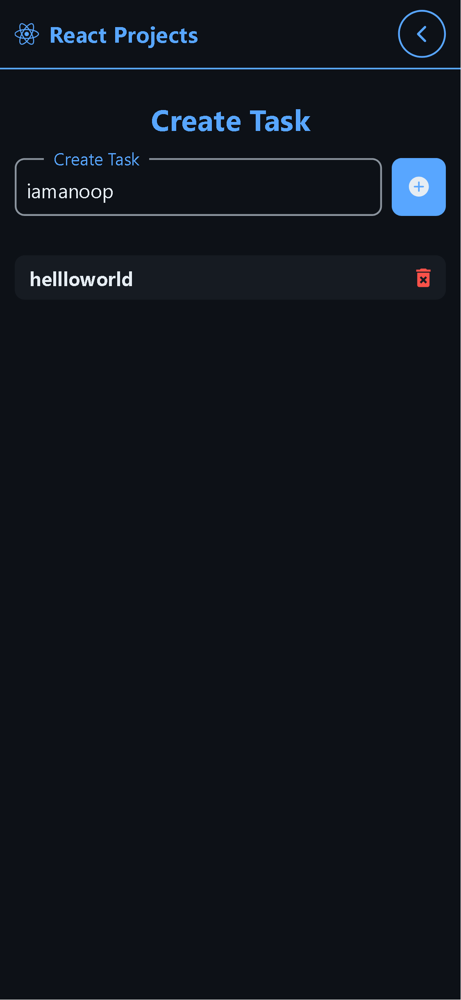
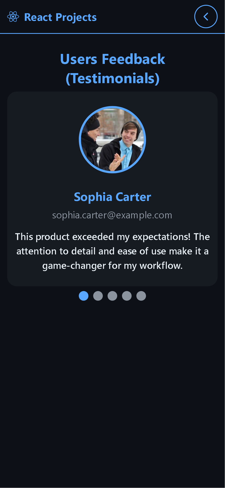
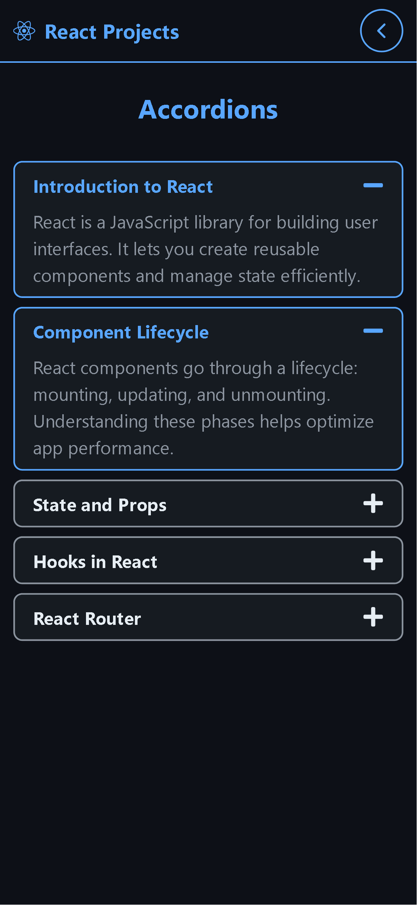
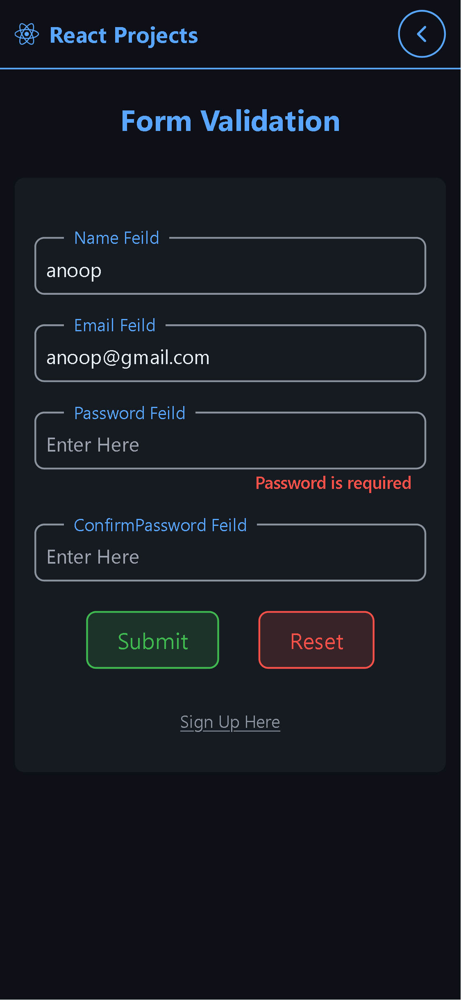
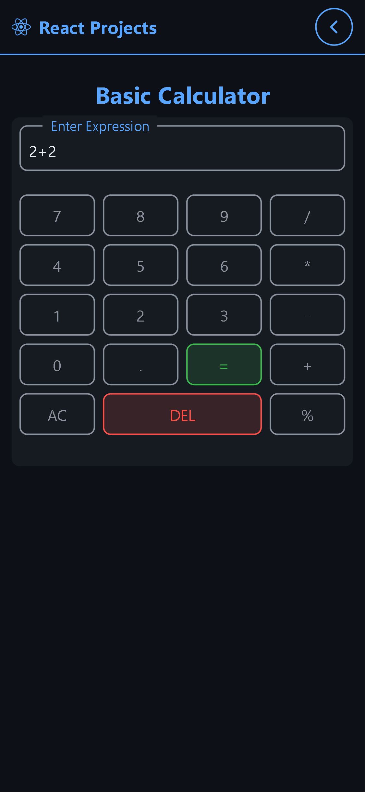
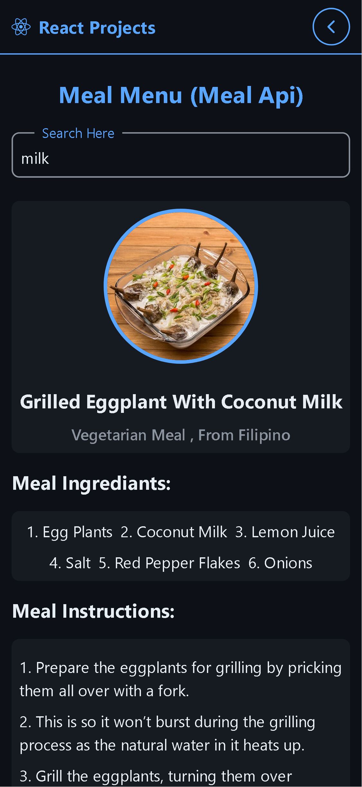
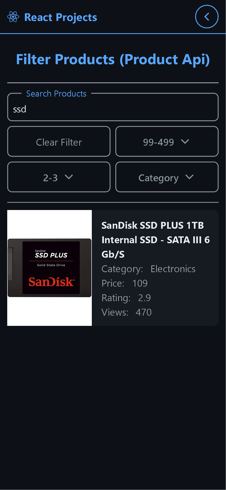

# React Projects Collection

This repository showcases a collection of React-based projects, each accessible through an interactive card interface. The projects demonstrate various functionalities and design patterns, utilizing technologies such as React, Tailwind CSS with PostCSS, and React Icons.

🚀 **Live Demo:** [https://anoop-rajoriya.github.io/react-projects/](https://anoop-rajoriya.github.io/react-projects/)

## Table of Contents

1. [To-Do App](#1-to-do-app)
2. [Testimonials](#2-testimonials)
3. [Accordions](#3-accordions)
4. [Form Validation](#4-form-validation)
5. [Calculator](#5-calculator)
6. [Meal API](#6-meal-api)
7. [Product Filtering](#7-product-filtering)

## Overview

The main application presents a series of cards, each representing a subproject. Users can click on a card to navigate to the respective subproject.

## Subprojects

### 1. To-Do App

A simple and intuitive to-do application allowing users to manage their tasks efficiently.



**Features:**

- Add and delete tasks
- Responsive design

### 2. Testimonials

A component showcasing user testimonials.



**Features:**

- Display multiple testimonials
- manual navigation
- Responsive layout

### 3. Accordions

An interactive accordion component to toggle content visibility.



**Features:**

- Expand and collapse sections
- Accessible design

### 4. Form Validation

A form demonstrating real-time validation for user inputs.



**Features:**

- Validate inputs such as email, password, etc.
- Display error messages dynamically
- Prevent form submission on invalid data

### 5. Calculator

A basic calculator for performing arithmetic operations.



**Features:**

- Perform addition, subtraction, multiplication, and division
- Clear functionality
- Responsive design

### 6. Meal API

An application fetching and displaying meal recipes from an external API.



**Features:**

- Search meals by name
- Display meal details and instructions
- Responsive layout

### 7. Product Filtering

An e-commerce component for filtering products based on categories and other criteria.



**Features:**

- Filter products by category, price, etc.
- Dynamic product listing
- Responsive design

## Technologies Used

- **React:** A JavaScript library for building user interfaces
- **Tailwind CSS with PostCSS:** Utility-first CSS framework for styling
- **React Icons:** Include popular icons in React projects

## Installation

To run the project locally:

1. Clone the repository:

   ```bash
   git clone https://github.com/Anoop-Rajoriya/react-projects.git
   ```

1. setup node environments:

   ```bash
   npm run i
   ```

1. run the dev server:

   ```bash
   npm run dev
   ```

👨‍💻 Author

    Anoop Rajoriya — GitHub

📜 License
This project is licensed under the MIT License — feel free to use and modify it as you like!
